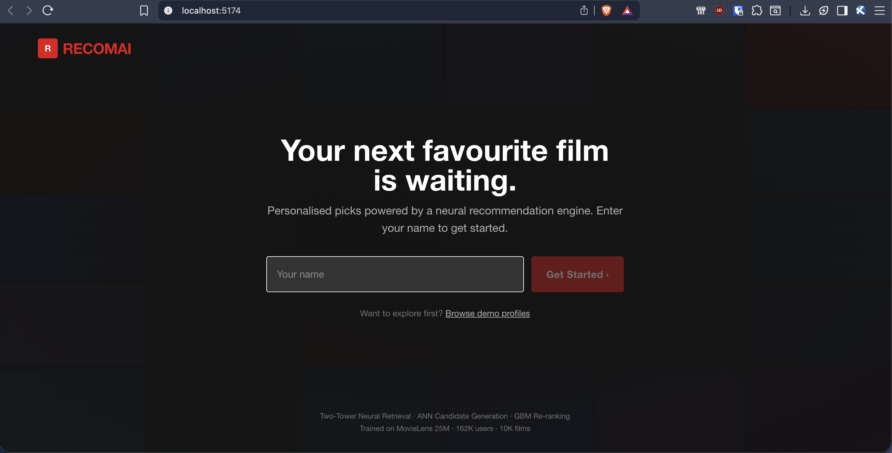
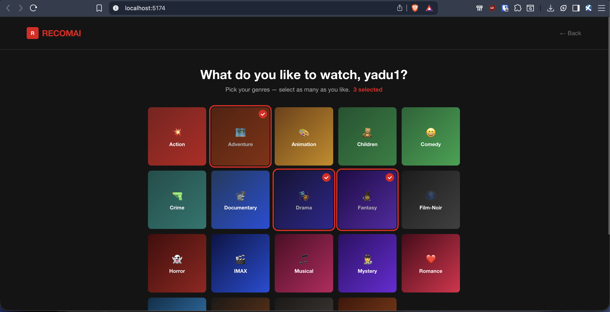
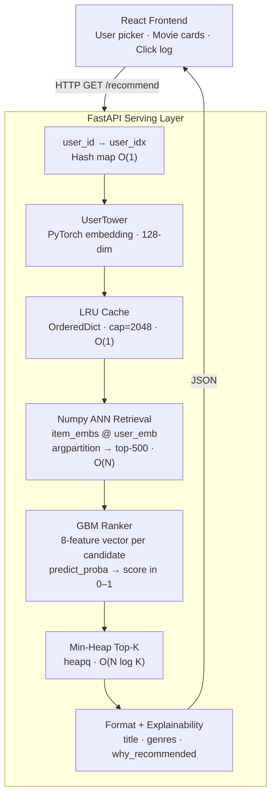

<div align="center">

# RECOMAI

### A Netflix-style movie recommendation engine — built from scratch.

<br/>

[](https://python.org)
[](https://pytorch.org)
[](https://fastapi.tiangolo.com)
[](https://reactjs.org)
[](https://tailwindcss.com)

<br/>

*Neural retrieval · gradient-boosted re-ranking · real-time personalisation*

</div>

---

## What is this?

RECOMAI is a full-stack recommendation system trained on the **MovieLens 25M dataset** — 25 million ratings from 162,000 users across 62,000 movies. The system uses a **Two-Tower neural network** to learn dense representations of both users and movies, retrieves the most relevant candidates in milliseconds, then re-ranks them with a gradient-boosted model for precision.

The frontend mirrors the feel of Netflix — dark, minimal, and fast. A first-time visitor enters their name, picks their favourite genres, and immediately gets personalised recommendations. No account, no password.

---

## 📸 Screenshots

<div align="center">

| Landing | Genre Picker | Recommendations |
|:---:|:---:|:---:|
|  |  |  |

</div>

---

## How it works

The recommendation pipeline runs in two stages every time a user requests their feed.

**Stage 1 — Retrieval**
The user's embedding (a 128-dimensional vector learned during training) is compared against every item in the catalogue using a dot-product similarity. The top 500 most similar movies are selected as candidates. For users who are brand new, a cold-start embedding is synthesised on the fly by averaging the item vectors of all movies matching their chosen genres.

**Stage 2 — Re-ranking**
Those 500 candidates are passed through a gradient-boosted classifier that scores each (user, movie) pair using 8 engineered features — embedding similarity, average rating, popularity, genre overlap, and cross-terms. The top 10 results are returned, each annotated with a human-readable explanation of *why* it was recommended.

The entire pipeline — from user embedding to ranked results — runs in under **20 ms**.

---
# Running RECOMAI Locally

## Prerequisites
- Python 3.11+
- Node 18+
- MovieLens 25M dataset — download from [grouplens.org/datasets/movielens/25m](https://grouplens.org/datasets/movielens/25m/), unzip into `data/`

---

## 1 — Clone the repo

```bash
git clone https://github.com/Yadu080/Two-Tower_Recommendation_System.git
cd Two-Tower_Recommendation_System
```

## 2 — Install dependencies

```bash
# Python
python -m venv venv
source venv/bin/activate
pip install -r requirements.txt

# Frontend
cd frontend && npm install && cd ..
```

## 3 — Train the models

Run each script in order:

```bash
source venv/bin/activate

python ml/scripts/preprocess.py
python ml/scripts/train_two_tower.py
python ml/scripts/generate_embeddings.py
python ml/scripts/train_ranker.py
python ml/scripts/evaluate.py
```

> Training takes ~15 min on Apple MPS or a GPU. CPU works too — just slower.

## 4 — Fetch movie posters (optional)

Create a `.env` file in the project root:

```
TMDB_API_KEY=your_key_here
```

Then run:

```bash
python ml/scripts/fetch_posters.py
```

> Skip this step and movie cards will show genre-coloured gradients instead of real posters.

## 5 — Start the app

Open two terminals:

```bash
# Terminal 1 — Backend
source venv/bin/activate
uvicorn backend.main:app --reload
```

```bash
# Terminal 2 — Frontend
cd frontend
npm run dev
```

Open **http://localhost:5173** in your browser.

---

## Deploying

### Backend → Render
- Connect your GitHub repo on [render.com](https://render.com)
- `render.yaml` is auto-detected
- Add `TMDB_API_KEY` as an environment variable in the Render dashboard
- Deploy — first build takes ~3–5 min

### Frontend → Vercel
- Import the repo on [vercel.com](https://vercel.com)
- Set root directory to `frontend`
- Add environment variable: `VITE_API_URL = https://your-render-service.onrender.com`
- Deploy — done in ~1–2 min
---

## Architecture



---

## Training Pipeline

The model is trained in a series of discrete phases. Each script is self-contained and can be re-run independently.

| Phase | Script | What it does |
|:-----:|--------|-------------|
| 1 | `preprocess.py` | Raw CSVs → temporal train/val split, contiguous ID maps, genre feature vectors |
| 2 | `train_two_tower.py` | InfoNCE loss with in-batch negatives, learnable temperature, MPS/CUDA/CPU support |
| 3 | `generate_embeddings.py` | Runs all 62K items through the trained ItemTower, saves as `item_embeddings.npy` |
| 4 | `build_faiss_index.py` | Builds an IVF index — 4.5× faster retrieval at 99.8% recall vs brute-force |
| 5 | `train_ranker.py` | Trains the GBM re-ranker on 42K (user, item) interaction pairs |
| 6 | `evaluate.py` | Recall@K and NDCG@K over 2,000 held-out users |
| 7 | `fetch_posters.py` | Pulls poster images from TMDb API for the full catalogue |

---

## Results

### Retrieval (Two-Tower)

Evaluated cold-start — no interaction history at inference time, 62K item catalogue.

| Metric | @10 | @50 | @100 |
|--------|:---:|:---:|:----:|
| Recall | 2.6% | 10.2% | 15.7% |
| NDCG | 1.1% | 2.8% | 3.8% |

### Re-ranker (GBM)

| | |
|---|---|
| Validation AUC | **0.9799** |
| Most important feature | `popularity × similarity` — 70% weight |
| Second feature | `embedding_similarity` — 23% weight |

### FAISS Benchmark

| Index | Recall@10 | Speed |
|-------|:---------:|:-----:|
| `IndexFlatIP` — exact search | 100% | baseline |
| `IndexIVFFlat` nlist=100, nprobe=10 | **99.8%** | **4.5× faster** |

---

## Tech Stack

| | |
|---|---|
| **Neural model** | PyTorch — Two-Tower with InfoNCE loss and in-batch negatives |
| **Re-ranker** | scikit-learn `GradientBoostingClassifier` |
| **Vector search** | FAISS IVF + numpy dot-product for live serving |
| **Backend** | FastAPI + Uvicorn |
| **Frontend** | React 18 · Vite · Tailwind CSS · Framer Motion |
| **Posters** | The Movie Database (TMDb) API |
| **Dataset** | MovieLens 25M — GroupLens Research |
| **Deployed on** | Render (backend) · Vercel (frontend) |

---

## API

```
GET  /recommend?user_id=42&n=10     personalised top-N results
GET  /users?n=30                    sample user list
GET  /genres                        available genre tags
POST /users/register                register a new user  { name, genres }
POST /log_click                     log a click          { user_id, movie_idx }
GET  /health                        service health + cache stats
```

**Sample response**

```json
{
  "user_id": 42,
  "display_name": "User 42",
  "results": [
    {
      "rank": 1,
      "title": "Shawshank Redemption, The (1994)",
      "genres": "Drama",
      "avg_rating": 4.43,
      "embedding_sim": 0.912,
      "ranking_score": 0.971,
      "why_recommended": "Matches your taste in Drama",
      "poster_url": "https://image.tmdb.org/t/p/w500/q6y0Go1tsGEsmtFryDOJo3dEmqu.jpg",
      "latency_ms": 18.3
    }
  ]
}
```

---

## Project Structure

```
Two-Tower_Recommendation_System/
│
├── ml/
│   ├── models/
│   │   ├── two_tower.py            ← model architecture
│   │   ├── two_tower.pt            ← trained weights
│   │   └── ranker.joblib           ← trained re-ranker
│   │
│   ├── scripts/
│   │   ├── preprocess.py
│   │   ├── train_two_tower.py
│   │   ├── generate_embeddings.py
│   │   ├── build_faiss_index.py
│   │   ├── train_ranker.py
│   │   ├── evaluate.py
│   │   └── fetch_posters.py
│   │
│   ├── embeddings/
│   │   └── item_embeddings.npy
│   │
│   └── data/
│       ├── item_meta.csv
│       ├── user_features.csv
│       ├── item_features.csv
│       ├── genre_vocab.json
│       ├── user_id_map.json
│       ├── movie_id_map.json
│       └── poster_map.json
│
├── backend/
│   ├── main.py                     ← FastAPI app + CORS + startup
│   ├── api/routes.py               ← all endpoints
│   └── core/recommender.py         ← retrieval + ranking engine
│
├── frontend/
│   └── src/
│       ├── App.jsx                 ← view state machine
│       ├── api.js                  ← fetch wrappers
│       └── components/
│           ├── LandingPage.jsx
│           ├── GenrePicker.jsx
│           ├── MovieCard.jsx
│           └── DemoDrawer.jsx
│
├── render.yaml                     ← Render deployment config
├── requirements.txt
└── README.md
```

---

<div align="center">

Built by **Yadunandan M Nimbalkar**

</div>
