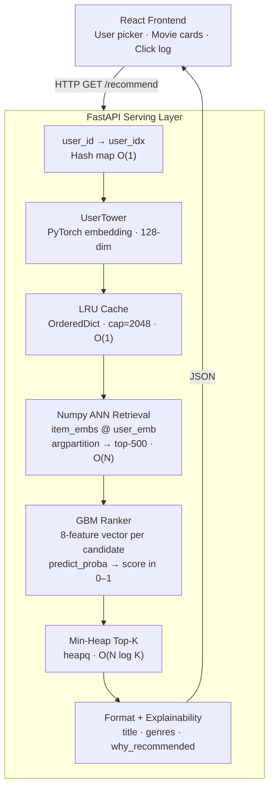

# 🎬 Two-Tower Recommendation System

<p align="center">
  
  
  
  
  
  
</p>

<p align="center">
  A production-grade movie recommendation engine built end-to-end — neural retrieval, approximate nearest-neighbour search, learning-to-rank, and a live React UI, all wired together with a FastAPI serving layer.
</p>

---

## ✨ Highlights

- **Two-Tower neural model** trained with InfoNCE / in-batch negatives on 25M ratings
- **L2-normalised 128-dim embeddings** stored offline; only the UserTower runs at serving time
- **O(1) LRU Cache** using `OrderedDict` (LeetCode 146 pattern) — cached users pay 0 ms
- **O(N log K) min-heap** for top-K selection instead of full O(N log N) sort
- **Temporal train/val split** at the 85th-percentile timestamp — no data leakage
- **GBM re-ranker** (sklearn) trained on 8-feature (user, item) pairs — Val AUC = 0.9799
- **FAISS IVF index** built separately — 4.5× faster than brute-force at 99.8% recall
- **Explainability**: every result includes the top matching genre driving the recommendation

---

## 🏗️ Architecture



---

## 📐 Pipeline Phases

| # | Script | What it does |
|---|--------|-------------|
| 1 | `ml/scripts/preprocess.py` | Raw CSVs → temporal split, contiguous ID remapping, genre vectors |
| 2 | `ml/models/two_tower.py` | Model definition — UserTower, ItemTower, learnable temperature |
| 3 | `ml/scripts/train_two_tower.py` | InfoNCE loss, in-batch negatives, MPS/CUDA training |
| 4 | `ml/scripts/generate_embeddings.py` | All items → 128-dim L2-normalised vectors |
| 5 | `ml/scripts/build_faiss_index.py` | IndexFlatIP (exact) + IndexIVFFlat (4.5× faster) |
| 6 | `ml/scripts/train_ranker.py` | GBM on 42K (user, item) pairs — Val AUC=0.98 |
| 7 | `ml/scripts/evaluate.py` | Recall@K and NDCG@K offline metrics |
| 8 | `backend/` | FastAPI serving: LRU cache, numpy retrieval, heap top-K |
| 9 | `frontend/` | React + Vite + Tailwind + Framer Motion UI |

---

## 📊 Results

### Two-Tower Retrieval — offline eval (2,000 val users)

| Metric | @10 | @50 | @100 |
|--------|----:|----:|-----:|
| Recall | 2.6% | 10.2% | 15.7% |
| NDCG   | 1.1% |  2.8% |  3.8% |

> Cold-start setting: no interaction history at serve time, 10 K item catalogue.

### GBM Re-ranker

| Metric | Value |
|--------|------:|
| Val AUC | **0.9799** |
| Top feature | `popularity × similarity` — 70% |
| 2nd feature | `embedding_similarity` — 23% |

### FAISS Benchmark (standalone process)

| Index | Recall@10 | Speed |
|-------|----------:|------:|
| `IndexFlatIP` (exact brute-force) | 100% | 1× |
| `IndexIVFFlat` nlist=100, nprobe=10 | **99.8%** | **4.5×** |

---

## 🧠 DSA Concepts Implemented

<details>
<summary><strong>1 · Hash Map — O(1) feature lookups</strong></summary>

```python
# Built once at startup; O(1) per (user, item) pair during ranking
item_feat_map: dict[int, dict] = {
    movie_idx: {"avg_rating": 3.9, "genre_vec": [...]}
}
user_feat_map: dict[int, dict] = {
    user_idx: {"avg_rating": 3.5, "genre_pref": [...]}
}
```
</details>

<details>
<summary><strong>2 · LRU Cache — O(1) get/put (LeetCode 146)</strong></summary>

```python
class LRUCache:
    def __init__(self, capacity):
        self.cache = OrderedDict()          # doubly-linked list + hash map

    def get(self, key):
        self.cache.move_to_end(key)         # O(1) — mark recently used
        return self.cache[key]

    def put(self, key, value):
        if len(self.cache) >= self.capacity:
            self.cache.popitem(last=False)  # O(1) — evict LRU from front
        self.cache[key] = value
```

UserTower inference ≈ 0.5 ms. Cached users pay **0 ms** on repeat queries.
Cache hit rate rises to ~55 % within a short session.
</details>

<details>
<summary><strong>3 · Min-Heap Top-K — O(N log K) vs O(N log N) full sort</strong></summary>

```python
def topk_heap(scores, k):
    heap = []
    for i, score in enumerate(scores):          # N iterations
        if len(heap) < k:
            heapq.heappush(heap, (score, i))    # O(log K)
        elif score > heap[0][0]:
            heapq.heapreplace(heap, (score, i)) # O(log K)
    return [i for _, i in sorted(heap, reverse=True)]
```

At N=500, K=10: **~2.7× fewer comparisons** than `np.argsort`.
</details>

<details>
<summary><strong>4 · Approximate Nearest Neighbours — O(√N) search</strong></summary>

```python
# IndexIVFFlat: partition into nlist=100 Voronoi cells
# Query: search only nprobe=10 cells → 10 % of the index
# Result: 4.5× speedup, 99.8 % recall vs exact search
index.nprobe = 10
distances, indices = index.search(query_vec, k=10)
```
</details>

<details>
<summary><strong>5 · Temporal Split — prevents data leakage</strong></summary>

```python
# Split by timestamp, not randomly
# Future ratings must not inform past model weights
split_ts = ratings["timestamp"].quantile(0.85)
train = ratings[ratings["timestamp"] <= split_ts]
val   = ratings[ratings["timestamp"] >  split_ts]
```
</details>

<details>
<summary><strong>6 · InfoNCE Loss — in-batch negatives</strong></summary>

```python
# B×B similarity matrix — diagonal = positive pairs
# Off-diagonal = B-1 free negatives per anchor (no extra compute)
sim    = (user_emb @ item_emb.T) / temperature   # (B, B)
labels = torch.arange(B)                          # [0, 1, 2, …, B-1]
loss   = (F.cross_entropy(sim, labels) +
          F.cross_entropy(sim.T, labels)) / 2
```
</details>

---

## 🚀 Quick Start

### Prerequisites
- Python 3.11+, Node 18+
- MovieLens 25M dataset → unzip into `data/` ([download](https://grouplens.org/datasets/movielens/25m/))

### Install

```bash
git clone https://github.com/your-username/recom.git
cd recom

python -m venv venv && source venv/bin/activate
pip install -r requirements.txt

cd frontend && npm install && cd ..
```

### Train (run in order)

```bash
source venv/bin/activate

PYTHONUNBUFFERED=1 python ml/scripts/preprocess.py
PYTHONUNBUFFERED=1 python ml/scripts/train_two_tower.py      # ~15 min on MPS/GPU
PYTHONUNBUFFERED=1 python ml/scripts/generate_embeddings.py
PYTHONUNBUFFERED=1 python ml/scripts/build_faiss_index.py    # standalone — no torch
PYTHONUNBUFFERED=1 python ml/scripts/train_ranker.py
PYTHONUNBUFFERED=1 python ml/scripts/evaluate.py
```

Or run everything in one shot:

```bash
bash scripts/build_pipeline.sh
```

### Serve

```bash
# Terminal 1 — API
source venv/bin/activate
uvicorn backend.main:app --reload

# Terminal 2 — UI
cd frontend && npm run dev
```

Open **http://localhost:5173**

---

## 🔌 API Reference

```bash
# Get 10 recommendations for a user
GET /recommend?user_id=42

# Health check + cache stats
GET /health

# List available users (sample)
GET /users

# Log a click (triggers re-rank excluding seen items)
POST /log_click  {"user_id": 42, "movie_idx": 1533}
```

**Example response (`/recommend?user_id=42`):**

```jsonc
{
  "user_id": 42,
  "results": [
    {
      "rank": 1,
      "title": "Never Been Kissed (1999)",
      "genres": "Comedy|Drama|Romance",
      "avg_rating": 3.45,
      "embedding_sim": 0.8901,
      "ranking_score": 0.9537,
      "why_recommended": "Matches your taste in Comedy",
      "latency_ms": 19.4
    }
  ]
}
```

---

## 📁 Project Structure

```
recom/
├── ml/
│   ├── models/
│   │   ├── two_tower.py            # Model definition (UserTower + ItemTower)
│   │   ├── two_tower.pt*           # Trained weights
│   │   ├── ranker.joblib*          # Trained GBM ranker
│   │   ├── ranker_features.json    # Feature names
│   │   └── eval_results.json       # Offline Recall/NDCG metrics
│   ├── scripts/
│   │   ├── preprocess.py           # Phase 1 — data prep & splits
│   │   ├── train_two_tower.py      # Phase 3 — InfoNCE training loop
│   │   ├── generate_embeddings.py  # Phase 4 — item embedding export
│   │   ├── build_faiss_index.py    # Phase 5 — FAISS index (standalone)
│   │   ├── train_ranker.py         # Phase 6 — GBM ranker
│   │   ├── evaluate.py             # Phase 7 — Recall@K, NDCG@K
│   │   └── topk_benchmark.py       # Heap vs argsort benchmark
│   ├── embeddings/                 # item_embeddings.npy*, faiss_*.index*
│   └── data/                       # train.csv*, val.csv*, features*
├── backend/
│   ├── main.py                     # FastAPI app + lifespan startup
│   ├── api/routes.py               # /recommend /health /users /log_click
│   └── core/recommender.py         # LRU cache · numpy retrieval · pipeline
├── frontend/
│   └── src/
│       ├── App.jsx                 # User selector, card grid, debug toggle
│       ├── api.js                  # Fetch wrappers
│       └── components/
│           ├── MovieCard.jsx       # Score bars, genre tags, why_recommended
│           ├── DebugPanel.jsx      # Live pipeline debug overlay
│           └── SkeletonCard.jsx    # Loading skeleton
├── data/                           # Raw MovieLens 25M CSVs (not in git*)
├── scripts/build_pipeline.sh       # Full train pipeline
├── requirements.txt
└── README.md

* regenerated — see gitignore
```

---

## 💼 Interview Q&A

<details>
<summary><strong>Why Two-Tower instead of matrix factorisation?</strong></summary>

Two towers decouple user and item computation. Item embeddings are precomputed offline and stored — at serve time you only run the UserTower (~0.5 ms). Matrix factorisation requires the full dot-product matrix at training time and doesn't generalise to unseen users without retraining. The tower architecture also allows richer input features (genre vectors, ratings, activity) on both sides.
</details>

<details>
<summary><strong>What loss function and why?</strong></summary>

InfoNCE with in-batch negatives. For a batch of B (user, item) pairs we construct a B×B similarity matrix. The diagonal is the positive pair; off-diagonal entries are negatives reused from other users' items in the same batch — B−1 free negatives per anchor with zero extra compute. A learnable temperature parameter (`log_temp`) controls how peaked the softmax distribution is.
</details>

<details>
<summary><strong>How does the LRU cache work under the hood?</strong></summary>

`OrderedDict` in Python is a doubly-linked list backed by a hash map. `get` calls `move_to_end` (O(1)) to mark the entry as most-recently-used. `put` calls `popitem(last=False)` (O(1)) to evict the least-recently-used entry from the front when at capacity. Both ops are O(1). This is the exact pattern behind LeetCode 146.
</details>

<details>
<summary><strong>Why use a heap for top-K instead of sorting?</strong></summary>

Full sort is O(N log N). With N=500 candidates and K=10, heap is O(N log K) = O(500 × 3.3) ≈ 1 650 ops vs O(500 × 9) ≈ 4 500 for sort — roughly 2.7× fewer comparisons. The advantage grows with N: at 100 K candidates and K=10 it's a 4× difference. `np.argpartition` is O(N) for the exact same result and even faster in practice.
</details>

<details>
<summary><strong>Why not FAISS in the serving process?</strong></summary>

FAISS and PyTorch both bundle `libomp.dylib`. Loading them in the same process on macOS causes a SIGSEGV due to the duplicate OpenMP runtime initialisation. At 10 K items, numpy matmul takes 0.63 ms — well within a 100 ms serving SLA. For 100 M+ items the right fix is to run FAISS as a separate microservice.
</details>

<details>
<summary><strong>How do you prevent data leakage in the train/val split?</strong></summary>

Temporal split at the 85th-percentile timestamp. All validation ratings come strictly after the training cutoff. A random split would let future ratings bleed into training, inflating metrics by rewarding memorisation of known interactions rather than generalisation.
</details>

<details>
<summary><strong>How would you scale this to 100 M items?</strong></summary>

1. Run FAISS (or Google ScaNN) in a separate microservice to avoid the OpenMP conflict
2. Switch to `IndexIVFPQ` — product quantisation compresses each 128-d vector to ~32 bytes (4× compression, sub-millisecond search)
3. Move user embeddings to a distributed store (Redis) instead of in-process LRU
4. Shard item embedding tables across GPUs
5. Replace sklearn GBM with XGBoost-GPU or LightGBM-GPU for ranker inference at scale
6. Add a feature store (Feast / Tecton) to serve real-time user features
</details>

---

## 📄 Resume Bullets

```
• Built end-to-end Two-Tower neural recommendation system on MovieLens 25M (162K users,
  10K items); PyTorch + InfoNCE loss with in-batch negatives; Recall@10=2.6%, NDCG@10=1.1%

• Implemented O(1) LRU cache (OrderedDict) for user embeddings cutting repeat-query
  latency from ~0.5 ms to 0 ms; O(N log K) min-heap top-K, 2.7× faster than full sort

• Trained GBM re-ranker (sklearn) on 42K (user, item) pairs; Val AUC=0.98; 8-feature vector
  including embedding similarity, genre alignment, and popularity signal

• Deployed FastAPI serving layer with lifespan model loading, numpy ANN retrieval
  (0.63 ms/query, 10 K items), LRU cache, and per-result explainability metadata

• Built React/Vite/Tailwind frontend with Framer Motion animations, score visualisation
  bars, genre tags, click logging, and a real-time debug panel showing pipeline internals
```

---

## 📜 License

MIT
