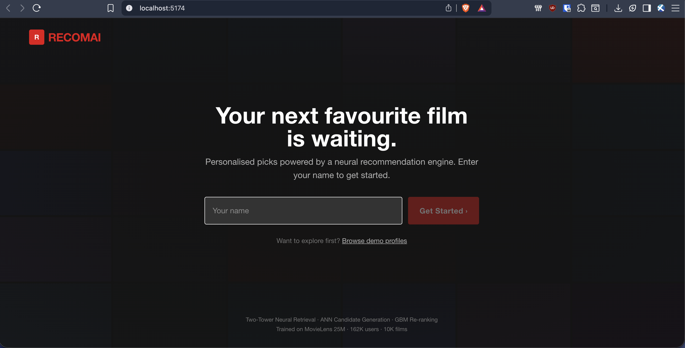
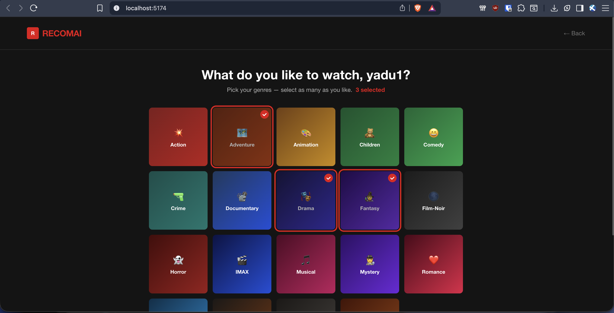
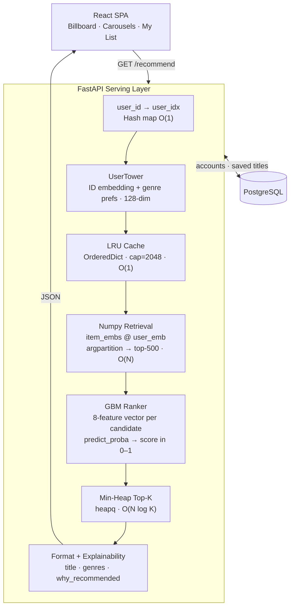

<div align="center">

# RECOMAI

**A two-stage neural movie recommender, built from scratch and deployed.**

[](https://python.org)
[](https://pytorch.org)
[](https://fastapi.tiangolo.com)
[](https://reactjs.org)
[](https://tailwindcss.com)
[](https://postgresql.org)

*Neural retrieval · gradient-boosted re-ranking · real-time personalisation*

</div>

---

## Overview

RECOMAI learns dense vector representations of users and movies, retrieves
candidates by similarity search, then re-ranks them with a gradient-boosted
classifier. It is trained on the **MovieLens 20M** dataset — 20 million ratings
from 138,493 users across 27,278 movies.

After filtering to active users (≥20 ratings) and popular movies (≥50 ratings)
and sampling 2M interactions, the served catalogue is **10,523 films**.

The interface follows the layout language of a streaming service: a hero
billboard, horizontal carousels, hover-expand cards. Visitors can browse
immediately as a guest, or create an account to keep their taste profile and
saved titles between visits.

<div align="center">

| Landing | Genre Picker | Recommendations |
|:---:|:---:|:---:|
|  |  |  |

</div>

---

## How it works

Scoring all 10,523 films with a heavyweight model on every page load is too
slow. The standard answer, which this project implements, is to split the work
across two stages with very different cost profiles.

**Stage 1 — Retrieval.** The user embedding is a 128-dimensional vector
combining a learned ID embedding with their normalised genre-preference vector.
It is compared against every catalogue item by dot product, and the top 500 are
kept as candidates. Because both towers L2-normalise their output, that dot
product *is* cosine similarity, so retrieval reduces to a single matrix
multiply.

**Stage 2 — Re-ranking.** Those 500 candidates pass through a gradient-boosted
classifier scoring each (user, movie) pair on 8 engineered features — embedding
similarity, average rating, popularity, genre overlap, and cross terms. The top
results are returned, each annotated with why it was chosen.

Cold-start users have no learned embedding, so one is synthesised on the fly by
averaging the item vectors of every film matching their chosen genres — placing
them in the same space as trained users, with no special-casing downstream.

End to end, retrieval through ranked results runs in roughly **20 ms**.

---

## Features

| | |
|---|---|
| **Two-stage recommendation** | ANN retrieval over the full catalogue, then precision re-ranking of the survivors |
| **Cold start** | New users get recommendations from genre choices alone, no rating history required |
| **Explainability** | Every result carries a match score and the genre that drove it; a debug toggle exposes raw model signals |
| **Live feedback** | Opening a title logs an implicit signal and re-ranks the next request |
| **Accounts** | Optional sign-up with bcrypt-hashed passwords and JWT sessions |
| **My List** | Saved titles persist across sessions and redeploys; works as a guest via local storage |

---

## Running locally

### Prerequisites

- Python 3.11+
- Node 18+
- MovieLens 20M — download from [grouplens.org](https://grouplens.org/datasets/movielens/20m/), unzip into `data/`

### 1. Clone and install

```bash
git clone https://github.com/Yadu080/Two-Tower_Recommendation_System.git
cd Two-Tower_Recommendation_System
```

```bash
python -m venv venv
source venv/bin/activate
pip install -r requirements.txt
```

```bash
cd frontend && npm install && cd ..
```

### 2. Train the models

Each script consumes the previous one's output, so run them in order:

```bash
python ml/scripts/preprocess.py
python ml/scripts/train_two_tower.py
python ml/scripts/generate_embeddings.py
python ml/scripts/train_ranker.py
python ml/scripts/evaluate.py
```

Training takes roughly 15 minutes on Apple MPS or a CUDA GPU. CPU works, slower.

### 3. Fetch posters (optional)

Create a `.env` in the project root with a [TMDB API key](https://www.themoviedb.org/settings/api):

```
TMDB_API_KEY=your_key_here
```

```bash
python ml/scripts/fetch_posters.py
```

Skip this and cards fall back to genre-coloured gradients. Current coverage is
97.7% (10,282 of 10,523 titles).

### 4. Start both services

```bash
# Terminal 1 — backend on :8000
source venv/bin/activate
uvicorn backend.main:app --reload
```

```bash
# Terminal 2 — frontend on :5173
cd frontend
npm run dev
```

Open <http://localhost:5173>. The frontend defaults to `http://localhost:8000`
for the API, and the backend falls back to a local SQLite file when
`DATABASE_URL` is unset — so no configuration is needed for local development.

---

## Deployment

Backend on Render, frontend on Vercel, Postgres on Neon or Supabase. Full
walkthrough in **[DEPLOYMENT.md](DEPLOYMENT.md)**.

| Service | Variable | Purpose |
|---|---|---|
| Render | `DATABASE_URL` | Postgres connection string |
| Render | `JWT_SECRET` | Signs session tokens — generated automatically by `render.yaml` |
| Render | `TMDB_API_KEY` | Poster artwork |
| Render | `ALLOWED_ORIGINS` | Extra CORS origins, comma separated |
| Vercel | `VITE_API_URL` | Backend URL, baked in at **build** time |

Two things that commonly go wrong: `VITE_API_URL` is read at build time, so
changing it requires a redeploy rather than a restart; and Render's own free
Postgres instances are deleted after 30 days, so prefer a provider whose free
tier has no expiry.

---

## Architecture


```mermaid
flowchart TD
    A[React SPA\nBillboard · Carousels · My List] -->|GET /recommend| B

    subgraph B[FastAPI Serving Layer]
        direction TB
        C[user_id → user_idx\nHash map O&lpar;1&rpar;]
        --> D[UserTower\nID embedding + genre prefs · 128-dim]
        --> E[LRU Cache\nOrderedDict · cap=2048 · O&lpar;1&rpar;]
        --> F[Numpy Retrieval\nitem_embs @ user_emb\nargpartition → top-500 · O&lpar;N&rpar;]
        --> G[GBM Ranker\n8-feature vector per candidate\npredict_proba → score in 0–1]
        --> H[Min-Heap Top-K\nheapq · O&lpar;N log K&rpar;]
        --> I[Format + Explainability\ntitle · genres · why_recommended]
    end

    B <-->|accounts · saved titles| J[(PostgreSQL)]
    I -->|JSON| A
```

---

## Training pipeline

Each script is self-contained and can be re-run independently.

| Phase | Script | What it does |
|:-----:|--------|-------------|
| 1 | `preprocess.py` | Raw CSVs → temporal train/val split, contiguous ID maps, genre feature vectors |
| 2 | `train_two_tower.py` | InfoNCE loss with in-batch negatives, learnable temperature, MPS/CUDA/CPU |
| 3 | `generate_embeddings.py` | Runs the catalogue through the trained ItemTower → `item_embeddings.npy` |
| 4 | `build_faiss_index.py` | Builds an IVF index — 4.5× faster at 99.8% recall (benchmark only; serving uses NumPy) |
| 5 | `train_ranker.py` | Trains the GBM re-ranker — features from train history, labels from val positives |
| 6 | `evaluate.py` | Recall@K and NDCG@K over 2,000 held-out users |
| 7 | `fetch_posters.py` | Pulls poster URLs from the TMDB API |

**Why a temporal split?** A random split lets the model train on a user's future
behaviour and predict their past — information that cannot exist at serving
time. Holding out each user's most recent 10% mirrors production: train on the
past, predict what came next.

---

## Results

### Retrieval

Warm-start evaluation over 2,000 sampled users who were present during
training, scored via their learned `UserTower` embedding against a temporally
held-out validation split.

| Metric | @10 | @50 | @100 |
|--------|:---:|:---:|:----:|
| Recall | **11.7%** | 22.7% | 29.5% |
| NDCG | **7.6%** | 10.0% | 11.2% |

Random selection from 10,523 items would yield Recall@10 of roughly 0.095%, so
this is about **123× better than chance** — within the range expected of a tuned
Two-Tower at this scale.

<details>
<summary>Earlier results, before the user tower had content features</summary>

The user tower was originally a bare ID embedding with no access to the genre
preference vector that preprocessing already computed. It could memorise
per-user patterns but not generalise across users with similar taste:

| Metric | @10 | @50 | @100 |
|--------|:---:|:---:|:----:|
| Recall | 2.6% | 10.2% | 15.7% |
| NDCG | 1.1% | 2.8% | 3.8% |

Feeding `genre_pref` into the tower took Recall@10 from 2.6% to 11.7% and
NDCG@10 from 1.1% to 7.6%. The NDCG gain is the more informative one: it
previously sat at under half of Recall@10, meaning relevant titles were being
retrieved but ranked near the bottom of the list.

</details>

### Re-ranker

Features are built from the `UserTower` embedding fit on the **train** split and
labelled against **validation** positives, so no label information reaches the
feature side and the training distribution matches what the backend produces at
serving time.

| | |
|---|---|
| Validation AUC | **0.9334** |
| Training pairs | 43,500 (8,700 positive / 34,800 negative) |

<details>
<summary>On the previously reported 0.9799</summary>

An earlier version of the training script derived each user's embedding by
averaging their *validation* positives, then used those same items as the
positive rows. Since the leading feature is the dot product against that
average, positives scored highly by construction — the model was partly
learning "was this item one of the vectors I was just averaged from." The two
features derived from it carried roughly 93% of feature importance.

Rebuilding features from a disjoint split brought AUC to the honest 0.9334.
Full analysis in [`docs/PROJECT_DEEP_DIVE.md`](docs/PROJECT_DEEP_DIVE.md).

</details>

### Approximate search benchmark

| Index | Recall@10 | Speed |
|-------|:---------:|:-----:|
| `IndexFlatIP` — exact | 100% | baseline |
| `IndexIVFFlat` nlist=100, nprobe=10 | 99.8% | 4.5× faster |

Not used in production. At 10,523 items an exact NumPy matmul already runs in
about 0.6 ms, so approximate search would be premature optimisation — and FAISS
conflicts with PyTorch's OpenMP runtime on macOS. Worth revisiting above roughly
a million vectors.

---

## Tech stack

| | |
|---|---|
| **Neural model** | PyTorch — Two-Tower with InfoNCE loss and in-batch negatives |
| **Re-ranker** | scikit-learn `GradientBoostingClassifier` |
| **Vector search** | NumPy dot product for serving; FAISS IVF benchmarked |
| **Backend** | FastAPI + Uvicorn |
| **Persistence** | PostgreSQL via SQLAlchemy (SQLite fallback for local dev) |
| **Auth** | bcrypt password hashing, JWT bearer tokens |
| **Frontend** | React 19 · Vite · Tailwind CSS · Framer Motion |
| **Posters** | The Movie Database (TMDB) API |
| **Dataset** | MovieLens 20M — GroupLens Research |
| **Hosting** | Render (backend) · Vercel (frontend) · Neon (database) |

---

## API

### Recommendations

```
GET  /recommend?user_id=42&n=10   personalised top-N results
GET  /users?n=30                  sample user list
GET  /genres                      available genre tags
POST /users/register              guest profile      { name, genres }
POST /log_click                   implicit feedback  { user_id, movie_idx }
GET  /health                      service health + cache stats
```

### Accounts

```
POST /auth/register               create account     { username, password, genres }
POST /auth/login                  obtain token       { username, password }
GET  /auth/me                     current profile
PUT  /auth/genres                 replace selection  { genres }
```

### My List

```
GET    /my-list?limit=15          saved titles, newest first
POST   /my-list                   save a title
DELETE /my-list/{movie_idx}       remove one
DELETE /my-list                   clear all
```

Authenticated routes expect `Authorization: Bearer <token>`. Tokens are sent as
a header rather than a cookie because the SPA and API are served from different
origins in production.

<details>
<summary>Sample recommendation response</summary>

```json
{
  "user_id": 42,
  "display_name": "User 42",
  "results": [
    {
      "rank": 1,
      "title": "Shawshank Redemption, The (1994)",
      "genres": "Drama",
      "avg_rating": 4.43,
      "embedding_sim": 0.912,
      "ranking_score": 0.971,
      "why_recommended": "Matches your taste in Drama",
      "poster_url": "https://image.tmdb.org/t/p/w500/...",
      "latency_ms": 18.3
    }
  ]
}
```

</details>

---

## Project structure

```
Two-Tower_Recommendation_System/
│
├── ml/
│   ├── models/
│   │   ├── two_tower.py            model architecture
│   │   ├── user_features.py        shared user-feature builder
│   │   ├── two_tower.pt            trained weights
│   │   └── ranker.joblib           trained re-ranker
│   │
│   ├── scripts/                    preprocess → train → evaluate
│   ├── embeddings/                 item_embeddings.npy · item_meta.csv
│   └── data/                       feature tables and ID maps
│
├── backend/
│   ├── main.py                     FastAPI app, CORS, startup
│   ├── api/
│   │   ├── routes.py               recommendations
│   │   ├── auth_routes.py          register · login · profile
│   │   └── list_routes.py          My List
│   ├── core/
│   │   ├── recommender.py          retrieval + ranking engine
│   │   └── auth.py                 hashing, JWT, dependencies
│   └── db/
│       ├── database.py             engine and session
│       └── models.py               User · ListItem
│
├── frontend/src/
│   ├── App.jsx                     view state machine, row derivation
│   ├── api.js                      fetch wrappers, token handling
│   ├── hooks/useMyList.js          server- or local-backed list state
│   └── components/                 Billboard · Row · MovieCard · AuthPage · …
│
├── docs/PROJECT_DEEP_DIVE.md       architecture, metrics, known limitations
├── DEPLOYMENT.md                   Render · Vercel · Postgres setup
├── render.yaml · runtime.txt       deployment config
└── requirements.txt
```

---

## Further reading

[`docs/PROJECT_DEEP_DIVE.md`](docs/PROJECT_DEEP_DIVE.md) covers the architecture
in depth: every technology from first principles, the alternatives weighed at
each decision point, how each metric is calculated and what counts as good, and
an honest account of the project's remaining limitations.

---

<div align="center">

Built by **Yadunandan M Nimbalkar**

</div>
